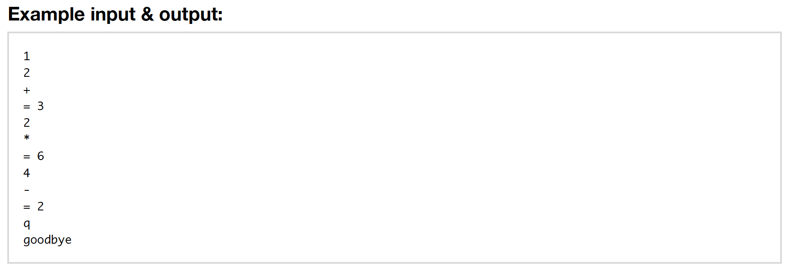

# RPN Calculator

The RPN Calculator is a CLI application that performs calculations based on the [Reverse Polish Notation](https://en.wikipedia.org/wiki/Reverse_Polish_notation).

## INSTRUCTIONS

* Fork and clone this repository
* Cd into the repository's directory, run `$ ruby app.rb`
* Get started by entering at least two numbers followed by an operator (+, -, \*, /, or \*\*).
* Only one input can be entered per line and there must be at least two numbers in the stack to perform an operation. If the operation results in a stack of one number, that number will be output.
* You may exit the application at any time by entering `q`

### COMMENTS
The App class acts as the runner and handles the flow as the user interacts with the application, and instantiates an instance of the Calculator class (in Calculator.rb) as an instance variable. My goal for this application was to follow the DRY principle and keep the code clean, efficient, and easy to follow. A couple of instances where I refactored my code for simplification include:
1. In the perform_calculation method of the Calculator class, I originally had a long case statement checking the value of the operator (as a string), and then performing the correct operation. Seeing this as a bit verbose and redundant, I researched ways to convert the string to the proper operator, and came across the public_send method which will perform the proper calculation based on the string input.
2. In the handle_input method, I originally had several Or statements to check to see if the input was one of the operators (`input == "+" || input == "-" || input == "/"`...). Again, I wanted to reduce this redundancy so instead created an array of those operators and simply checked to see if that array included the user input, and broke this into a separate method for clarity.
